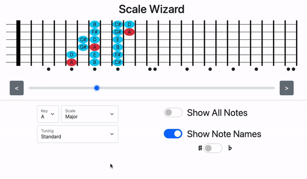
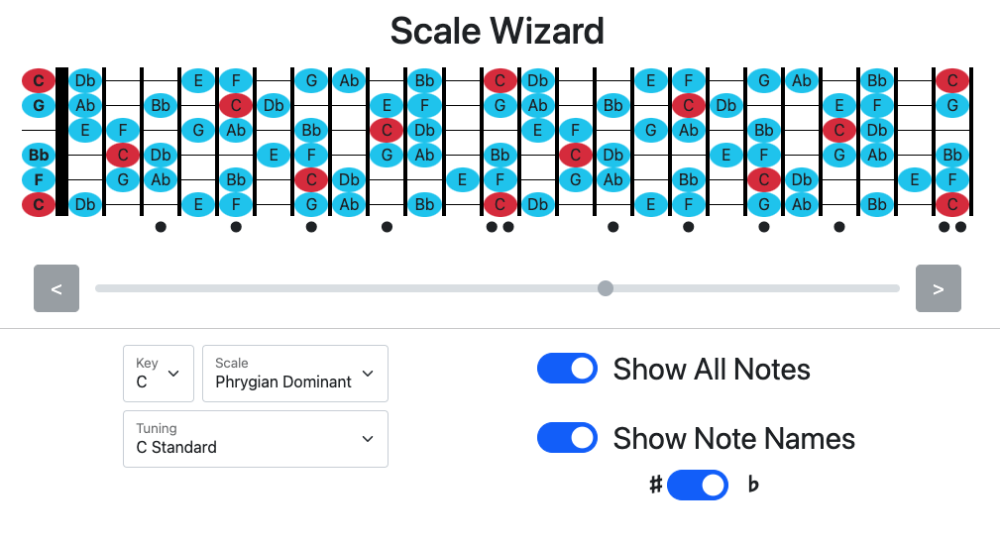

# Scale Wizard - Master the fretboard fast!

Made with React | [LIVE SITE](https://scale-wizard.web.app/)

### Scale Wizard is an interactive guide for people studying guitar and bass, allowing them to easily visualize scales across the fretboard.

 

### Many early students are only learning a couple of scales, and stuck in a single position. Scale Wizard helps with pattern recognition and getting players out of the "box" to unlock new musical potential.

 

## Set your key, scale, and tuning. Then select your position.

 

## Supports all common scales, modes, and tunings. Even a few exotic ones!

 

 ## [Try it on the live site](https://scale-wizard.web.app/)